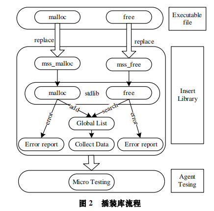
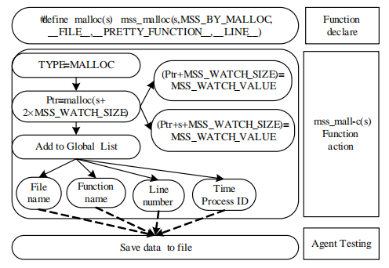
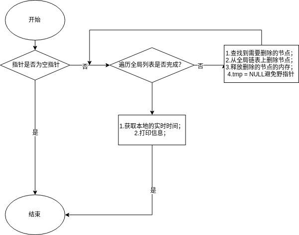

# 嵌入式软件动态内存检测工具的设计与实现

## 一、Micro Testing 模块设计(Insert Library (插装库的设计))

​	Insert Library 里一个全局链表 List 保存每次申请的内存地址；当释放内存时，在链表里搜索给定内存地址，然后从链表里删除，保证数据一致性。链表的操作需要包含linux内核的list.h文件，这个文件是经过修改而可以在用户空间使用的链表操作文件，这个文件有关于双向环形链表的操作的方法。笔者参考：https://github.com/Akagi201/list.git

### 1.1. 插装库函数的实现



下面给出 2 个主要函数 malloc 和 free 的实现原理，其他函数的实现类似。

声明

```c
#define malloc(s) mss_malloc(s,MSS_BY_MALLOC, \
__FILE__, __PRETTY_FUNCTION__, __LINE__)
#define free(p) mss_free(p,MSS_BY_FREE, \
__FILE__, __PRETTY_FUNCTION__, __LINE__)
```

**1)malloc 函数**
函数的实现如图 3 所示，具体流程为：①设置函数类型，主要是方便 Server 分析。②前后多分配 MSS_WATCH_SIZE字节，并且写入特殊的值。③把申请成功的内存的开始地址保存到全局链表。④统计信息，包括调用 malloc 函数的文件名、函数名、行号、申请时间、具体大小、进程号等，并发
送给测试代理。其中，__FILE__, __PRETTY_FUNCTION__, __LINE__是 Linux 下的宏，用来获得文件名、函数名以及行号；MSS_BY_MALLOC 用来区别函数类型。



```flow
flowchat
st=>start: 开始
e=>end: 结束
op=>operation: malloc分配内存
cond=>condition: 内存分配成功？
op1=>operation: 1.创建全局列表的新节点；
2.填充节点信息；
3.把新的节点加入到全局列表中；
4.获取本地实时时间
5.打印信息
op2=>operation: 获取本地实时时间
st->op->cond
cond(yes)->op1->e
cond(no)->e

```

```c
void *mss_malloc(size_t __size, int type, \
                const char *file, const char *func, int line) 
{
        char *ptr = (char *)malloc(__size);
        if (ptr == NULL) {
                printf("malloc failed\n");
                return NULL;
        }else {
                mylist = (struct global_list *)malloc(sizeof(struct global_list));
                mylist->addr = ptr;
                mylist->size = __size;
                list_add(&(mylist->list), &(head.list));
                get_local_time();
                printf("[mss_malloc]>>>file: %s, func: %s, line: %d, \
                        time: %s, addr:%x, size: %d, pid: %d\n", \
                        file, func, line, datetime, ptr, __size, getpid());
                global_list_for_each();
                printf("malloc ok\n");
                return ptr;
        }
}
```

**2)free 函数**
函数声明中的宏与 malloc 一样，流程为：①设置函数类型。②搜索全局链表，如果找到相应的地址，就调用标准库里的 free 函数，释放空间。③统计信息，包括调用 malloc 函数的文件名、函数名、行号、申请时间、具体大小、进程号等，并发送给测试代理。Service 端接收数据保存，然后及时采用以下算法对数据进行分析

```c
void *mss_free(void *__ptr, int type, \
                const char *file, const char *func, int line)
{
        if (__ptr == NULL) {
                printf("free failed\n");
                return NULL;
        }else {
                list_for_each_entry_safe(pos, next, &head.list, list) {
                        tmp = list_entry(&pos->list, struct global_list, list); 
                        if(__ptr == tmp->addr) {
                                list_del(&pos->list);
                                free(tmp);
                            	tmp = NULL;
                        }
                }
                get_local_time();
                printf("[mss_free]>>>file: %s, func: %s, line: %d, \
                        time: %s, addr:%x, size: %d, pid: %d\n", \
                        file, func, line, datetime, tmp->addr, tmp->size, getpid());
                global_list_for_each();
                free(__ptr);
                printf("free ok\n");
        }
}

```


### 1.2. 数据分析算法

1.内存泄漏检测算法

​	内存泄露。遍历记录内存申请信息的链表，如果链表不为空，则链表中的每个节点都代表一个泄露的内存块

```c
/*
* 内存泄露检测算法，
* 内存泄露。遍历记录内存申请信息的链表，如果链表
* 不为空，则链表中的每个节点都代表一个泄露的内
*/
void mm_leak_detect(void)
{
        if(list_empty(&head.list) == 0) {
                printf("Memory leaked!\n");
                global_list_for_each();
        }else {
                printf("Memory is ok\n");
        }
}
```

2.野指针的判断

​	遍历记录保存内存申请信息的链表，取出链表中的每个节点，然后在循环体内部判断待检测的指针的地址是否在链表的节点的开始或内部，如果是，就不是野指针，如果是NULL不是野指针

```c
/*
* 野指针检测算法，
* 遍历记录保存内存申请信息的链表，取出链
* 表中的每个节点，然后在循环体内部判断待检测的指针的地址是否在
* 链表的节点的开始或内部，如果是，就不是野指针，如果是NULL不是野指针
* return:0表示不是野指针；-1表示是一个野指针
*/
int wild_ptr_detect(void *__ptr)
{
        if(__ptr == NULL) {
                 printf("%x is not  a wild pointer!\n",__ptr);
                 return 0;
        }
        list_for_each_entry(pos, &head.list, list) {
                tmp = list_entry(&pos->list, struct global_list, list); 
                if(tmp == __ptr) {
                        printf("%x is not  a wild pointer!\n",__ptr);
                        return 0;
                }
        }
        printf("%x is a wild pointer!\n",__ptr);
        return -1;
}
```